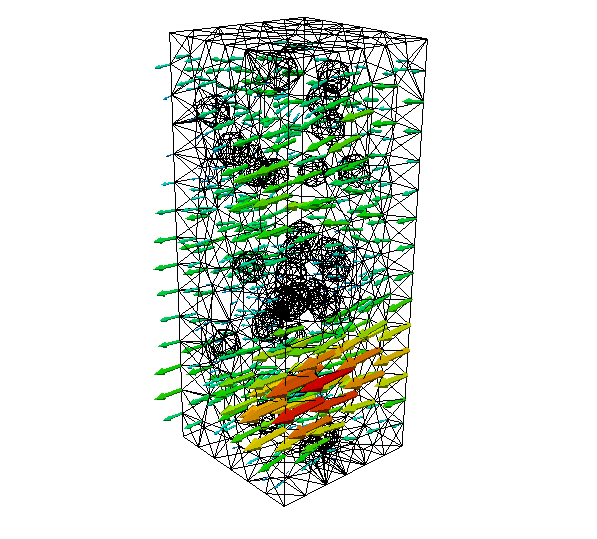

# Trials of TensorFlow from a Computationalist

afq, November 2017

## Intro
This is a small collection of my trials learning TensorFlow. There's a lot of different examples out there that seem overly complex and aren't really using the intended idioms. The documentation itself is no exception. (devs: Add a wiki talk page!) The notebooks and utilities are the best code I can write after sifting through everything I've dredged up on the internet, while constantly pestering my dear friend E. H. at Brain. 

The useful routines I've been writing get refactored into [afqstensorflowutil](https://github.com/afqueiruga/afqstensorflowutil).

## Impetus

The example datafile 'fractureplane.db' included in this repository are the results of a finite element simulation of steady state Stokes flow coded up in [FEniCS](fenicsproject.org) to sample the flow of a fluid around proppants. Each sample is a different random distribution of particles with different densities and fracture heights. The FEniCS code that automatically meshes and solves these this problem is in [churn_parallel_flow.py](churn_parallel_flow.py). One of these samples looks like this:

The database was written with my library [SimDataDB](https://bitbucket.org/afqueiruga/simdatadb/) that some of the notebooks require to load. (It's just sqlite3 with one table with fields Dp, h, n, and v.) The simulation also requires [afqsfenicsutils](https://bitbucket.org/afqueiruga/afqsfenicsutils/) to run, but pre-generated data is included in the aforementioned database.

With this super simple prototype, we're just looking for a function that looks like this:
$$\bar{v} = f(\Delta p,h,n)$$
The "real" research will make these all vector arguments and include more parameters, and tackle a wider range of problems.

My goals are:

1. Designing models that fit physical phenomena with emergent nonlinearities and phase boundaries.
2. Higher order methods for training (Newton's, Jacobian-free nonlinear CG, etc.)
3. Turn the trained model into something that can be used in a scientific code.
4. Check the in-production usage against the original training data and requesting new data points.

## Progress

1. [polynomials.ipynb](polynomials.ipynb) : Fitting the given data to a basis of polynomials. Uses the objective's Hessian to do this in one step.
2. [model_loading.ipynb](model_loading.ipynb): Loading the saved model, freezing the variables, and rewriting a trimmed down graph.
3. [hessian_mnist.ipynb](hessian_mnist.ipynb): A side track investigating the hessian matrix of the softmax mnist model, trying to use the Newton solver I wrote for item 1.
4. [loadfromc](loadfromc): The progression of C files that can load one of these protobuf files and execute them using the TensorFlow API.
5. [wraptfmodel](wraptfmodel): A better wrapper for managing loading and calling a model using the C API.
6. [model_input_gradients.ipynb](model_input_gradients.ipynb): Computing and examining the gradients of a model with respect to its inputs.

The file [afqstensorutils.py](afqstensorutils.py) contains all of the utility functions I'm writing.

The scripts [start_docker.sh](start_docker.sh) and [start_venv.sh](start_venv.sh) are how I load up the TensorFlow environment on my Mac (with docker) and my Linux box (with a virtualenv install), respectively. 
